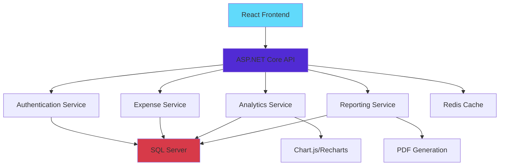
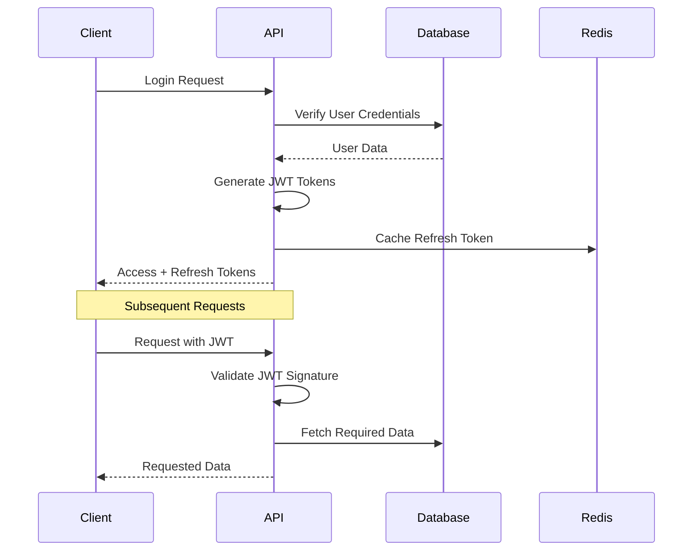

# 💰 Expenzo - Modern Expense Tracker

<div align="center">


**Enterprise-Grade Personal Finance Management with Advanced Analytics & Secure Authentication**

[](#)
[](#api-documentation)

</div>

## 🎯 Overview

Expenzo is a comprehensive **full-stack expense tracking solution** built with modern technologies. It provides individuals and businesses with powerful tools to manage finances, analyze spending patterns, and make data-driven financial decisions with enterprise-grade security and performance.

## ✨ Key Features

### 🔐 Enterprise Security
- **JWT Authentication** with refresh token rotation
- **BCrypt Password Hashing** with salt rounds
- **Role-based Access Control** (RBAC) ready
- **Secure API Endpoints** with rate limiting
- **Data Encryption** at rest and in transit

### 💰 Advanced Expense Management
- **Smart Categorization** with custom categories
- **Recurring Expenses** with automated tracking
- **Receipt Upload & OCR** for digital records
- **Multi-currency Support** with real-time conversion
- **Tax Deduction Tracking** for business expenses

### 📊 Business Intelligence
- **Real-time Analytics Dashboard** with interactive charts
- **Spending Trends** with predictive insights
- **Budget Planning** with alert notifications
- **Export Capabilities** (PDF, Excel, CSV)
- **Financial Reports** with custom date ranges

### 🌐 Modern UX/UI
- **Progressive Web App** (PWA) capabilities
- **Dark/Light Theme** with system preference detection
- **Offline Functionality** with sync capabilities
- **Mobile-First Responsive** design
- **Accessibility** (WCAG 2.1 compliant)

## 🏗️ System Architecture

### High-Level Architecture
```
Frontend (React PWA) → API Gateway → Backend Services → Data Layer → External Services
```

### Component Architecture


## 🛠️ Tech Stack

### Backend Excellence
| Layer | Technology | Purpose |
|-------|------------|---------|
| **Framework** | ASP.NET Core 8.0 | High-performance web API |
| **ORM** | Entity Framework Core 8.0 | Database operations |
| **Database** | SQL Server 2022 | Enterprise data storage |
| **Caching** | Redis | Session & query caching |
| **Authentication** | JWT + BCrypt.NET | Secure access control |
| **Documentation** | Swagger/OpenAPI | API documentation |
| **Testing** | xUnit + Moq | Unit & integration tests |

### Frontend Innovation
| Layer | Technology | Purpose |
|-------|------------|---------|
| **Framework** | React 18.2 | Modern UI development |
| **Styling** | TailwindCSS 3.3 | Utility-first CSS |
| **Charts** | Recharts | Interactive data visualization |
| **HTTP Client** | Axios | API communication |
| **Routing** | React Router v6 | Client-side navigation |
| **State** | Context API + useReducer | Global state management |
| **PWA** | Workbox | Offline functionality |

## 🚀 Quick Start

### Prerequisites
- [.NET 8.0 SDK](https://dotnet.microsoft.com/download/dotnet/8.0)
- [Node.js 18.0+](https://nodejs.org/)
- [SQL Server 2022](https://www.microsoft.com/en-us/sql-server/sql-server-downloads)
- [Redis](https://redis.io/download) (optional for caching)

### Installation & Setup

#### 1. Clone Repository
```bash
git clone https://github.com/your-username/expenzo.git
cd expenzo
```

#### 2. Backend Configuration

**Database Setup:**
```bash
# Navigate to backend
cd Expenzo.Api

# Apply database migrations
dotnet ef database update

# Seed initial data
dotnet run seed
```

**Environment Configuration (`appsettings.json`):**
```json
{
  "ConnectionStrings": {
    "DefaultConnection": "Server=localhost;Database=ExpenzoDB;Trusted_Connection=true;TrustServerCertificate=true;",
    "Redis": "localhost:6379"
  },
  "Jwt": {
    "SecretKey": "your-64-character-super-secure-key-for-production-use-only",
    "Issuer": "ExpenzoAPI",
    "Audience": "ExpenzoClient",
    "ExpiryMinutes": 60,
    "RefreshExpiryDays": 7
  },
  "Cors": {
    "AllowedOrigins": ["http://localhost:3000", "https://yourapp.vercel.app"]
  }
}
```

#### 3. Frontend Setup
```bash
# Navigate to frontend
cd ../expenzo-frontend

# Install dependencies
npm install

# Start development server
npm run dev
```

#### 4. Production Build
```bash
# Backend
dotnet publish -c Release -o ./publish

# Frontend
npm run build
```

## 📊 Database Schema Design

### Core Entities
```sql
-- Users table with enhanced security
CREATE TABLE Users (
    Id UNIQUEIDENTIFIER PRIMARY KEY,
    Username NVARCHAR(50) UNIQUE NOT NULL,
    Email NVARCHAR(255) UNIQUE NOT NULL,
    PasswordHash NVARCHAR(255) NOT NULL,
    CreatedAt DATETIME2 DEFAULT GETUTCDATE(),
    LastLogin DATETIME2,
    IsActive BIT DEFAULT 1,
    Currency NVARCHAR(3) DEFAULT 'USD'
);

-- Categories with hierarchy support
CREATE TABLE Categories (
    Id INT PRIMARY KEY IDENTITY,
    Name NVARCHAR(100) NOT NULL,
    Description NVARCHAR(500),
    ParentCategoryId INT NULL,
    Color NVARCHAR(7) DEFAULT '#3B82F6',
    Icon NVARCHAR(50) DEFAULT 'receipt',
    UserId UNIQUEIDENTIFIER NULL, -- NULL for system categories
    FOREIGN KEY (ParentCategoryId) REFERENCES Categories(Id),
    FOREIGN KEY (UserId) REFERENCES Users(Id)
);

-- Expenses with comprehensive tracking
CREATE TABLE Expenses (
    Id UNIQUEIDENTIFIER PRIMARY KEY DEFAULT NEWID(),
    UserId UNIQUEIDENTIFIER NOT NULL,
    Title NVARCHAR(200) NOT NULL,
    Amount DECIMAL(18,2) NOT NULL,
    CategoryId INT NOT NULL,
    Description NVARCHAR(1000),
    ExpenseDate DATE NOT NULL,
    CreatedAt DATETIME2 DEFAULT GETUTCDATE(),
    UpdatedAt DATETIME2 DEFAULT GETUTCDATE(),
    ReceiptUrl NVARCHAR(500),
    IsRecurring BIT DEFAULT 0,
    RecurringFrequency NVARCHAR(20), -- Daily, Weekly, Monthly, Yearly
    Tags NVARCHAR(500), -- JSON array of tags
    FOREIGN KEY (UserId) REFERENCES Users(Id),
    FOREIGN KEY (CategoryId) REFERENCES Categories(Id)
);

-- Budgets for financial planning
CREATE TABLE Budgets (
    Id UNIQUEIDENTIFIER PRIMARY KEY DEFAULT NEWID(),
    UserId UNIQUEIDENTIFIER NOT NULL,
    CategoryId INT NOT NULL,
    Amount DECIMAL(18,2) NOT NULL,
    Month DATE NOT NULL, -- First day of month
    CreatedAt DATETIME2 DEFAULT GETUTCDATE(),
    FOREIGN KEY (UserId) REFERENCES Users(Id),
    FOREIGN KEY (CategoryId) REFERENCES Categories(Id)
);
```

## 🔌 API Documentation

### Authentication Endpoints
| Method | Endpoint | Description | Auth Required |
|--------|----------|-------------|---------------|
| `POST` | `/api/auth/register` | User registration | ❌ |
| `POST` | `/api/auth/login` | User authentication | ❌ |
| `POST` | `/api/auth/refresh` | Refresh JWT token | ✅ |
| `POST` | `/api/auth/logout` | User logout | ✅ |

### Expense Management
| Method | Endpoint | Description | Parameters |
|--------|----------|-------------|------------|
| `GET` | `/api/expenses` | Get user expenses | `page, pageSize, filters` |
| `POST` | `/api/expenses` | Create new expense | `ExpenseDto` |
| `PUT` | `/api/expenses/{id}` | Update expense | `ExpenseDto` |
| `DELETE` | `/api/expenses/{id}` | Delete expense | - |
| `GET` | `/api/expenses/analytics` | Expense analytics | `startDate, endDate` |

### Sample API Usage

**User Registration:**
```http
POST /api/auth/register
Content-Type: application/json

{
  "username": "john_doe",
  "email": "john@example.com",
  "password": "SecurePass123!",
  "currency": "USD"
}
```

**Add Expense:**
```http
POST /api/expenses
Authorization: Bearer {jwt-token}
Content-Type: application/json

{
  "title": "Monthly Groceries",
  "amount": 245.75,
  "categoryId": 3,
  "expenseDate": "2024-01-15",
  "description": "Weekly grocery shopping at Whole Foods",
  "tags": ["groceries", "food", "essential"]
}
```

**Get Analytics:**
```http
GET /api/expenses/analytics?startDate=2024-01-01&endDate=2024-01-31
Authorization: Bearer {jwt-token}
```

## 📱 Application Features

### Dashboard Overview
- **Real-time Spending Overview** with monthly comparisons
- **Category-wise Distribution** with interactive pie charts
- **Budget vs Actual** spending analysis
- **Recent Transactions** with quick actions
- **Financial Health Score** based on spending patterns

### Advanced Filtering & Search
- **Multi-dimensional Filtering** by date, amount, category, tags
- **Full-text Search** across expense titles and descriptions
- **Saved Filter Presets** for frequent queries
- **Export Filtered Results** in multiple formats

### Smart Analytics
- **Spending Trends** with forecasting
- **Category Insights** with comparative analysis
- **Monthly Reports** with year-over-year comparison
- **Custom Date Range** analytics
- **Interactive Visualizations** with drill-down capabilities

## 🔒 Security Implementation

### Authentication Flow


### Security Headers Configuration
```csharp
// Program.cs - Security Middleware
app.UseHsts();
app.UseHttpsRedirection();

app.UseCors("AllowSpecificOrigin");

app.Use(async (context, next) =>
{
    context.Response.Headers.Add("X-Frame-Options", "DENY");
    context.Response.Headers.Add("X-Content-Type-Options", "nosniff");
    context.Response.Headers.Add("X-XSS-Protection", "1; mode=block");
    context.Response.Headers.Add("Referrer-Policy", "strict-origin-when-cross-origin");
    context.Response.Headers.Add("Content-Security-Policy", "default-src 'self'");
    
    await next();
});
```

## 🚀 Deployment

### Backend Deployment (Azure)
```yaml
# azure-pipelines.yml
trigger:
- main

pool:
  vmImage: 'windows-latest'

variables:
  solution: '**/*.sln'
  buildPlatform: 'Any CPU'
  buildConfiguration: 'Release'

steps:
- task: DotNetCoreCLI@2
  displayName: 'Restore'
  inputs:
    command: 'restore'
    projects: '**/*.csproj'

- task: DotNetCoreCLI@2
  displayName: 'Build'
  inputs:
    command: 'build'
    arguments: '--configuration $(buildConfiguration)'

- task: DotNetCoreCLI@2
  displayName: 'Publish'
  inputs:
    command: 'publish'
    arguments: '--configuration $(buildConfiguration) --output $(Build.ArtifactStagingDirectory)'

- task: PublishBuildArtifacts@1
  displayName: 'Publish Artifacts'
```

### Frontend Deployment (Vercel)
```json
// vercel.json
{
  "version": 2,
  "builds": [
    {
      "src": "package.json",
      "use": "@vercel/static-build",
      "config": {
        "distDir": "build"
      }
    }
  ],
  "routes": [
    {
      "src": "/(.*)",
      "dest": "/index.html"
    }
  ],
  "env": {
    "REACT_APP_API_URL": "https://your-api.azurewebsites.net"
  }
}
```

## 🧪 Testing Strategy

### Backend Testing
```csharp
// Example Unit Test
public class ExpenseServiceTests
{
    [Fact]
    public async Task CreateExpense_ValidData_ReturnsExpenseDto()
    {
        // Arrange
        var mockRepo = new Mock<IExpenseRepository>();
        var service = new ExpenseService(mockRepo.Object);
        var createDto = new CreateExpenseDto 
        { 
            Title = "Test Expense", 
            Amount = 100.50m,
            CategoryId = 1
        };

        // Act
        var result = await service.CreateExpenseAsync(createDto, Guid.NewGuid());

        // Assert
        Assert.NotNull(result);
        Assert.Equal(createDto.Title, result.Title);
        mockRepo.Verify(x => x.AddAsync(It.IsAny<Expense>()), Times.Once);
    }
}
```

### Frontend Testing
```javascript
// Example Component Test
import { render, screen, fireEvent } from '@testing-library/react';
import { ExpenseForm } from './ExpenseForm';

test('submits expense form with valid data', async () => {
  const mockSubmit = jest.fn();
  
  render(<ExpenseForm onSubmit={mockSubmit} />);
  
  fireEvent.change(screen.getByLabelText(/title/i), {
    target: { value: 'Test Expense' }
  });
  
  fireEvent.change(screen.getByLabelText(/amount/i), {
    target: { value: '100.50' }
  });
  
  fireEvent.click(screen.getByRole('button', { name: /add expense/i }));
  
  expect(mockSubmit).toHaveBeenCalledWith({
    title: 'Test Expense',
    amount: 100.50,
    categoryId: expect.any(Number)
  });
});
```

## 🤝 Contributing

We welcome contributions! Please see our development guide:

### Development Setup
1. **Fork the repository**
2. **Set up development environment**
   ```bash
   git clone https://github.com/your-username/expenzo.git
   cd expenzo
   ./scripts/setup-dev.sh
   ```

3. **Follow our coding standards**
   - Backend: C# coding conventions
   - Frontend: ESLint + Prettier configuration
   - Commit messages: Conventional commits

### Pull Request Process
1. Create feature branch from `develop`
2. Implement changes with tests
3. Update documentation
4. Submit PR with detailed description

## 📈 Performance Optimization

### Backend Optimizations
- **EF Core Query Optimization** with AsNoTracking
- **Redis Caching** for frequent queries
- **Pagination** for large datasets
- **Compressed Responses** with gzip
- **Database Indexing** strategy

### Frontend Optimizations
- **Code Splitting** with React.lazy
- **Memoization** with React.memo and useMemo
- **Virtualized Lists** for large datasets
- **Image Optimization** with WebP format
- **Bundle Analysis** with webpack-bundle-analyzer

## 🐛 Troubleshooting

### Common Issues & Solutions

**Database Connection Issues:**
```bash
# Check SQL Server service
sudo systemctl status mssql-server

# Verify connection string
dotnet user-secrets list

# Reset migrations if needed
dotnet ef migrations remove
dotnet ef migrations add InitialCreate
dotnet ef database update
```

**Frontend Build Issues:**
```bash
# Clear cache and reinstall
rm -rf node_modules package-lock.json
npm install

# Check environment variables
npm run check-env
```

## 📄 License

This project is licensed under the MIT License - see the [LICENSE](LICENSE) file for details.

## 🙏 Acknowledgments

- **ASP.NET Core Team** for the robust web framework
- **React Team** for the revolutionary UI library
- **TailwindCSS** for the utility-first CSS approach
- **Chart.js & Recharts** for beautiful data visualization
- **SQL Server Team** for enterprise-grade database solutions

---

<div align="center">

### ⭐ Star this repository if you find it helpful!

**Built with ❤️ using ASP.NET Core, React, and modern web technologies**

[Report Bug](https://github.com/your-username/expenzo/issues) · [Request Feature](https://github.com/your-username/expenzo/issues)

</div>

---
